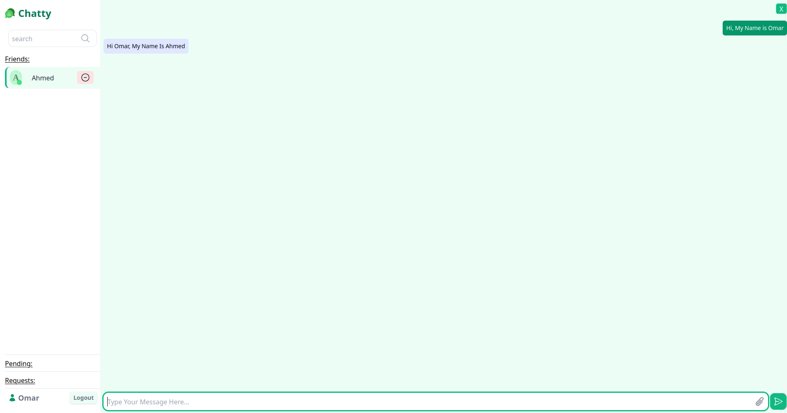
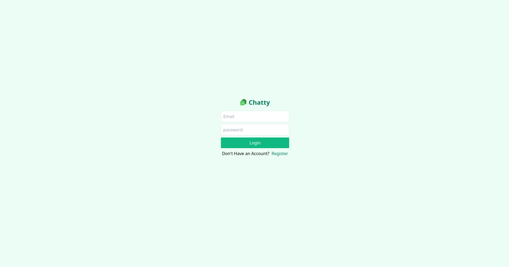
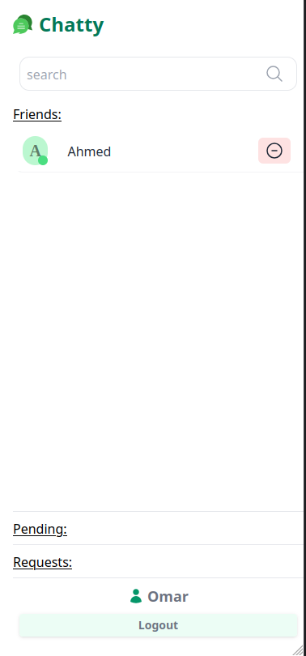
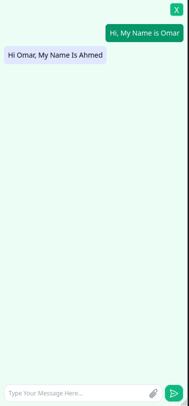
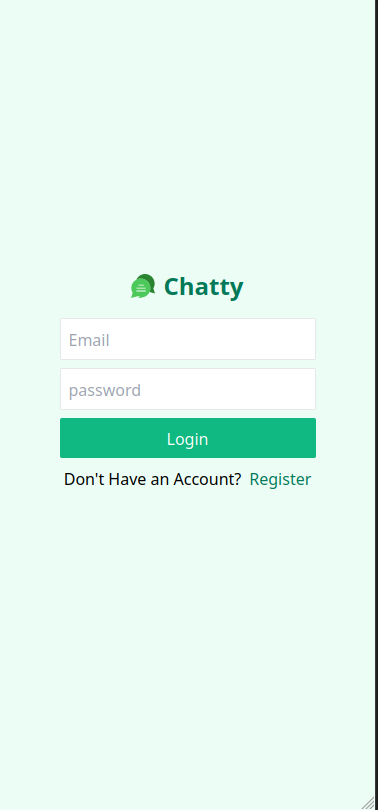

# 💬 FullStack ChatApp

A real-time full-stack chat application built with React, Express, Typescript, and MongoDB. Supports one-on-one messaging, user authentication, and live socket communication.

**Live Demo:** [Click to view Chatty](https://chattyapp-by-omar.vercel.app/)

## 🚀 Features

- 🔐 User authentication (signup, login, JWT)
- 💬 Real-time messaging with WebSockets
- 🧑‍🤝‍🧑 One-on-one private chats
- 📱 Responsive UI for desktop and mobile
- 🌐 RESTful API for user and chat management
- 🗃️ MongoDB integration for message persistence

## 🛠️ Tech Stack

**Frontend:**

- React
- Tailwind

**Backend:**

- Node.js + Express
- WebSockets for real-time comms

**Database:**

- MongoDB

**Others:**

- JWT for authentication
- dotenv for environment variables

## 🔌 APIs Used

- **Custom REST APIs**: Built with Express for user authentication, chat, and messaging.
- **WebSocket API**: For real-time messaging using the native WebSocket protocol (via `ws`).
- **MongoDB Atlas API** : Used as a cloud-based database service.

## 📡 API Endpoints

### User

- `POST /users/register` – Register a new user
- `POST /users/login` – Authenticate and receive a JWT
- `GET /users/logout` – Remove JWT Cookie
- `GET /users/profile` – Get User Info and Check If isLoggedIn
- `GET /users/friends` – Get User Friends, Pending and Sent Requests
- `GET /users/friend/add/:id` – Send a Friend Request
- `GET /users/friend/request/:id` – Reject Friend Request
- `GET /users/friend/request/sent/:id` – Remove Sent Friend Request
- `GET /users/friend/accept/:id` – Accept Friend Request
- `GET /users/friend/remove/:id` – Remove Friend

### Messages

- `GET messages/:userId` – Fetch all messages in a chat With The User

---

## 📸 Screenshots




<p align="center">
  
  
  
</p>

---

## 🧑‍💻 Getting Started

### Prerequisites

- Node.js
- npm / yarn
- MongoDB Atlas account (or local instance)

### Environment Variables

Create a `.env` file in both `backend/` and `frontend/` directories and add the following:

**backend/.env**

```bash
DATABASE=your_mongo_connection_string
JWT_SECRET=your_jwt_secret
FRONT_URL=http://localhost:5173
PORT=3000

```

**frontend/.env**

```bash
VITE_BACKEND_URL=http://localhost:3000
VITE_WebSocket_URL=localhost:3000
```

## Installation

### Backend

```
cd backend
npm install
npm run dev
```

### Frontend

```
cd frontend
npm install
npm run dev
```

## 🎥 Inspiration

This project was inspired by [Build a Fullstack CHAT App using MERN (mongo, express, react, node)](https://www.youtube.com/watch?v=mYy-d6BtqmU) by **Coding With Dawid**. It provided a great foundation for building real-time chat apps with sockets and authentication.
